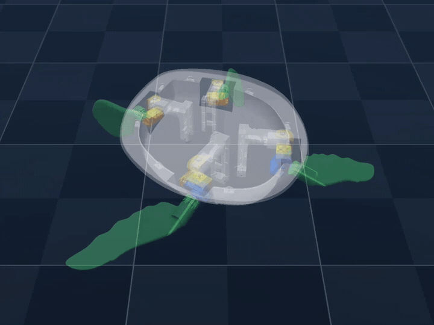
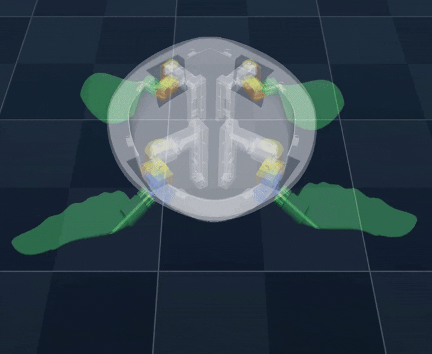

# 🐢 Training Turtle Locomotion using Reinforcement Learning in MuJoCo

A custom Gymnasium environment for training turtle locomotion using reinforcement learning in the MuJoCo simulator. The environment has been configured for a custom Turtle robot; however, it can be extended to train other robots.

An MJCF model is provided for the Turtle robot, tuned for position control with a proportional controller.

### Trained Model with Position Actions and a Proportional Controller



## Setup

```bash
python -m pip install -r requirements.txt
```

## Current Work

The current `turtle_mujoco_env.py` and `turtle_train.py` have integrated an energy-centric reward policy that encourages reduced energy consumption, allowing the robot to autonomously select appropriate gaits. This approach is inspired by the paper "Adaptive Energy Regularization for Autonomous Gait Transition and Energy-Efficient Quadruped Locomotion" ([arXiv:2403.20001](https://arxiv.org/abs/2403.20001)) by Boyuan Liang et al. (2025).

### Trained Model with the Energy-Centric Reward Policy



## Training

```bash
python turtle_train.py --run train
```

## Finetune from a Pretrained Model

Continue training (finetune) from an existing `best_model` checkpoint:

```powershell
python turtle_train.py --run train --model_path <path to model zip file> --total_timesteps 3000000 --run_name finetune_v1 --curriculum_start_vy -0.352
```

> Note: `--curriculum_start_vy -0.352` means the curriculum velocity starts at `-0.352 m/s` and progressively increases to `-1.0 m/s` during finetuning.

## Displaying Trained Models

```bash
python turtle_train.py --run test --model_path <path to model zip file>
```

For example, to execute a pretrained model which outputs motor torques and has the robot desired velocity set to <x=1, y=0>, run:

```bash
python turtle_train.py --run test --model_path ./models/2026-05-16_23-42-36/final_model.zip
```

## Acknowledgements

This work builds upon the [quadruped-rl-locomotion](https://github.com/nimazareian/quadruped-rl-locomotion) repository. Many thanks to the original authors for making it straightforward to port and adapt the environment to train the Turtle robot! 🐢✨
